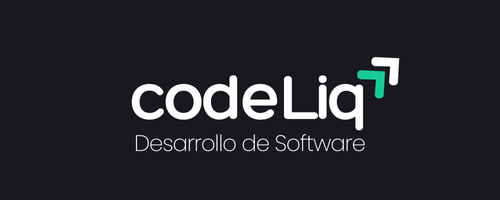

# 🚀 CodeLiq - Soluciones SaaS Modernas



## 📱 Vista Previa

El proyecto está optimizado para una experiencia perfecta tanto en escritorio como en dispositivos móviles.

## 🛠️ Tecnologías Utilizadas

- **Frontend:**

  - React 18+ con Vite para un desarrollo ultrarrápido
  - Material-UI para componentes elegantes y responsivos
  - CSS-in-JS para estilos dinámicos
  - React Router para navegación fluida

- **Backend:**
  - Node.js con Express para el servidor API
  - MySQL para la base de datos
  - CORS configurado para desarrollo seguro

## ⚡ Características Principales

### 🎨 Diseño Moderno

- Tema oscuro elegante
- Diseño completamente responsivo
- Animaciones suaves y transiciones
- Header con efecto de vidrio (glassmorphism)

### 📝 Formulario de Contacto

- Validación en tiempo real
- Límite de 255 caracteres para mensajes
- Modal de confirmación con Material-UI
- Gestión de estados de carga y error
- Integración con base de datos MySQL

### 🔄 API Integration

```javascript
POST /api/contact
Content-Type: application/json

{
  "name": "string",
  "email": "string",
  "message": "string (max 255 chars)"
}
```

## 🚀 Inicio Rápido

1. **Clonar el repositorio:**

   ```bash
   git clone https://github.com/tuusuario/codeliq.git
   cd codeliq
   ```

2. **Instalar dependencias:**

   ```bash
   npm install
   ```

3. **Configurar variables de entorno:**
   Crear archivo `.env` en la raíz:

   ```env
   DB_HOST=tu-host
   DB_PORT=tu-puerto
   DB_USER=tu-usuario
   DB_PASSWORD=tu-contraseña
   DB_NAME=tu-base-de-datos
   ```

4. **Iniciar el proyecto:**

   ```bash
   # Desarrollo
   npm run dev:all    # Inicia frontend y backend

   # Solo frontend
   npm run dev

   # Solo backend
   npm run server
   ```

## 📱 Soporte Móvil

El proyecto está optimizado para dispositivos móviles con:

- Menú hamburguesa responsive
- Layouts adaptables
- Botones y formularios optimizados para touch
- Media queries para diferentes breakpoints

## 🌐 Acceso en Red Local

Para acceder desde otros dispositivos en la red:

1. El servidor Vite se expone automáticamente
2. Accede usando la IP local: `http://tu-ip-local:5173`
3. API disponible en `http://tu-ip-local:3000`

## 🔒 Seguridad

- Validación de datos en frontend y backend
- Protección CORS configurada
- Conexión SSL para la base de datos
- Sanitización de inputs

## 📦 Estructura del Proyecto

```bash
codeliq/
├── src/
│   ├── api/          # Endpoints de la API
│   ├── assets/       # Recursos estáticos
│   ├── components/   # Componentes reutilizables
│   ├── database/     # Configuración de BD
│   └── pages/        # Páginas principales
├── server.js         # Servidor Express
└── vite.config.js    # Configuración de Vite
```

## 🤝 Contribuir

1. Fork el proyecto
2. Crea tu rama de feature (`git checkout -b feature/AmazingFeature`)
3. Commit tus cambios (`git commit -m 'Add: AmazingFeature'`)
4. Push a la rama (`git push origin feature/AmazingFeature`)
5. Abre un Pull Request

## 📜 Licencia

Este proyecto está bajo la Licencia MIT. Ver `LICENSE` para más información.

---

Desarrollado con ❤️ por CodeLiq
